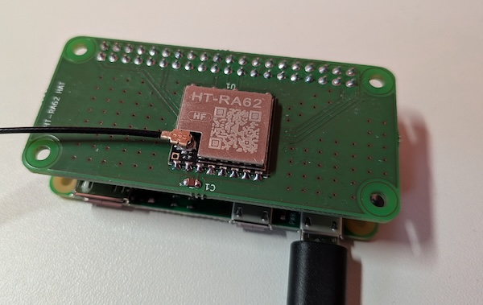

# LoRa shield for RPi

This is the most basic LoRa shield for the RPi using the SX1262 based module HT-RA62.

Upload the latest gerber zip file to a manufacturer of your choice (jlcpcb, aisler, ...), spend a few bucks, wait a few days and enjoy.
HT-RA62 are available on Aliexpress for a few bucks each and easy to solder.
Add a 20x2 female pin header and if you are fealing fancy, add a 100nF cap.

RXEN and TXEN are not connected, neither are DIO2 and DIO3. They are not required for the LoRa module to work.

Pinout:

```
RST  --> GPIO18
DIO1 --> GPIO16
NSS  --> GPIO21
MOSI --> GPIO10
MISO --> GPIO9
SCK  --> GPIO11
BUSY --> GPIO20
```

Use this e.g. with pyMC and add these lines to the config file:

```
use_dio3_tcxo=true
use_dio2_rf=true
```





